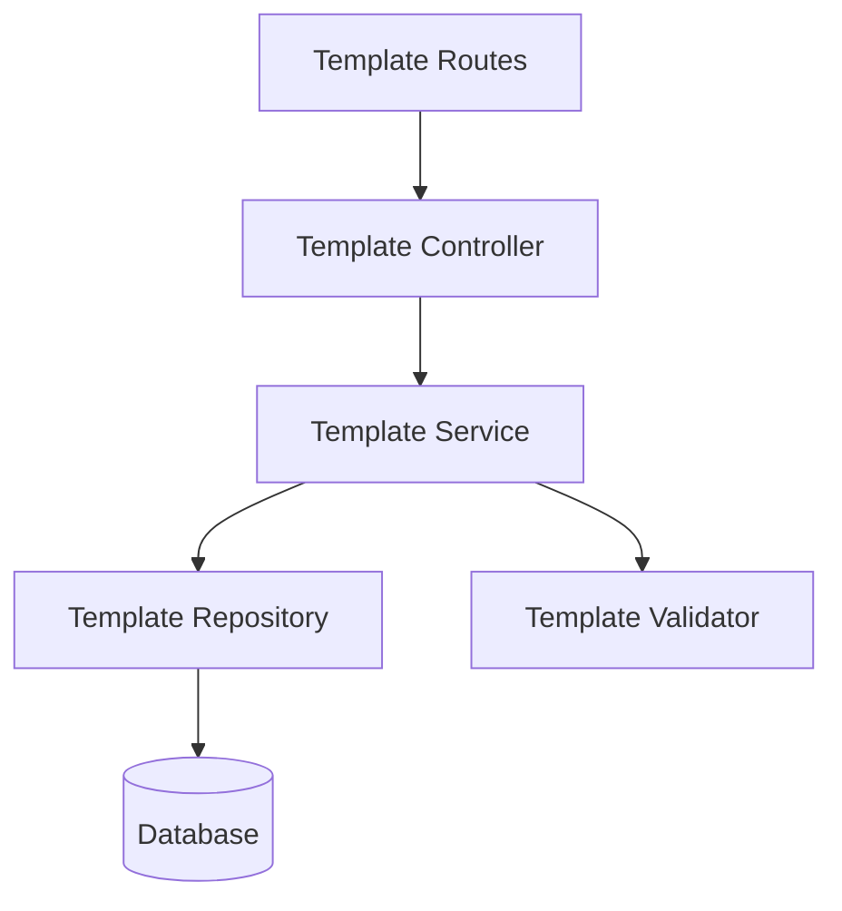
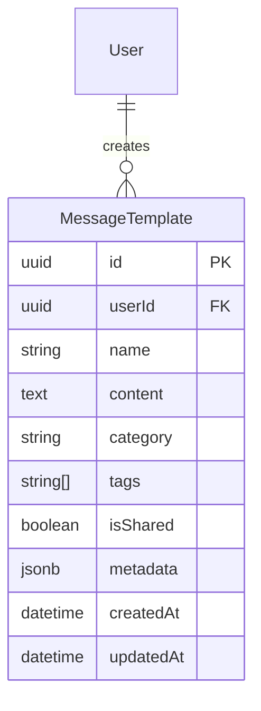
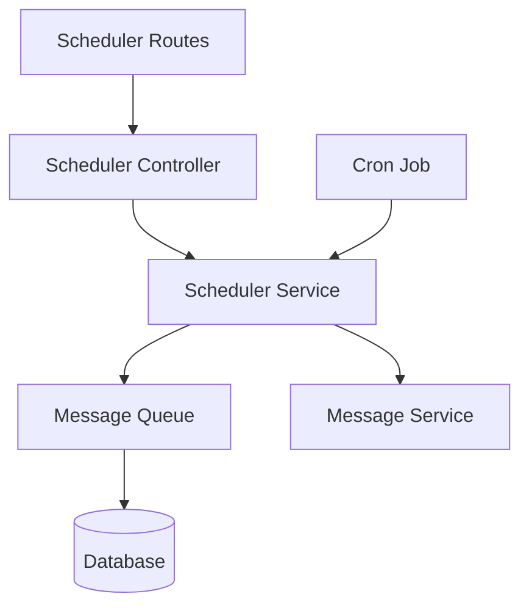
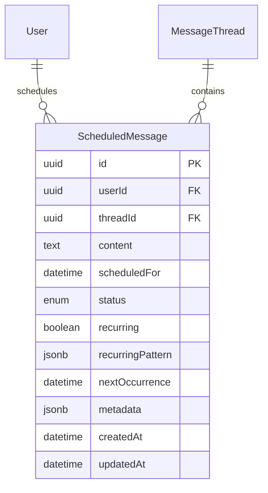
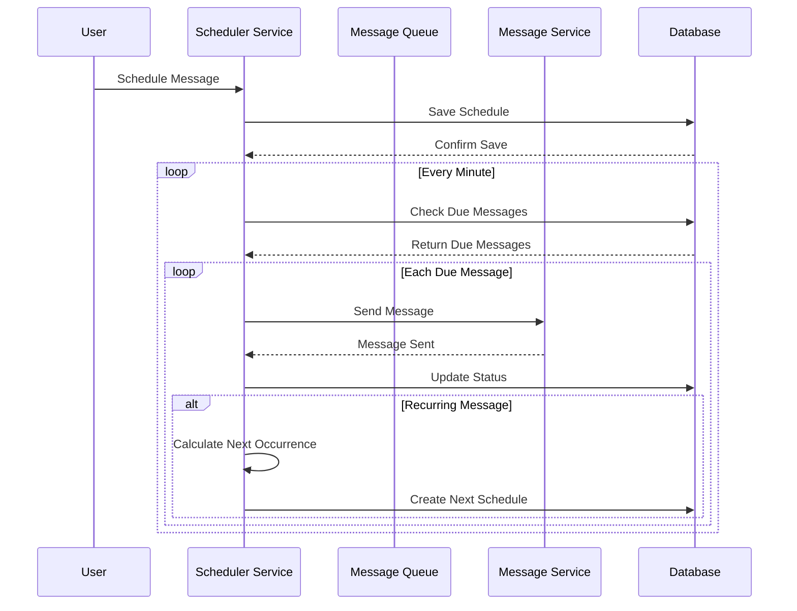

# WSPR Web Architecture

## 📁 Project Structure

```
wspr-web/
├── client/                 # Frontend React application
│   ├── src/
│   │   ├── components/    # Reusable UI components
│   │   │   ├── Auth/     # Authentication components
│   │   │   │   ├── WebAuthnRegister.tsx
│   │   │   │   ├── WebAuthnLogin.tsx
│   │   │   │   ├── RecoveryKeySetup.tsx
│   │   │   │   └── RecoveryKeyLogin.tsx
│   │   │   ├── Chat/     # Chat-related components
│   │   │   │   ├── Message.tsx
│   │   │   │   ├── MessageStatus.tsx
│   │   │   │   ├── MessageTemplates.tsx
│   │   │   │   └── ScheduledMessages.tsx
│   │   │   └── ...
│   │   ├── features/     # Feature-specific components
│   │   ├── hooks/        # Custom React hooks
│   │   │   ├── useWebAuthn.ts
│   │   │   ├── useRecoveryKey.ts
│   │   │   ├── useMessageStatus.ts
│   │   │   └── useWebSocket.ts
│   │   ├── pages/        # Route pages
│   │   ├── services/     # API and service layer
│   │   │   ├── WebAuthnService.ts
│   │   │   ├── RecoveryKeyService.ts
│   │   │   ├── message-template.service.ts
│   │   │   ├── message-management.service.ts
│   │   │   └── scheduled-message.service.ts
│   │   ├── store/        # State management
│   │   ├── types/        # TypeScript type definitions
│   │   │   ├── auth.ts
│   │   │   ├── message.ts
│   │   │   └── ...
│   │   └── utils/        # Utility functions
├── server/                # Backend Node.js application
│   ├── src/
│   │   ├── controllers/  # Request handlers
│   │   │   ├── auth/
│   │   │   │   ├── webauthn.controller.ts
│   │   │   │   └── recovery.controller.ts
│   │   │   ├── message/
│   │   │   │   ├── message.controller.ts
│   │   │   │   └── scheduled-message.controller.ts
│   │   │   └── ...
│   │   ├── models/       # Database models
│   │   │   ├── User.js
│   │   │   ├── WebAuthnCredential.js
│   │   │   ├── MessageTemplate.js
│   │   │   ├── ScheduledMessage.js
│   │   │   └── ...
│   │   ├── routes/       # API routes
│   │   │   ├── auth.js
│   │   │   ├── message.js
│   │   │   └── scheduled-message.js
│   │   ├── services/     # Business logic
│   │   │   ├── webauthn.service.ts
│   │   │   ├── recovery.service.ts
│   │   │   ├── message-template.service.ts
│   │   │   ├── message-management.service.ts
│   │   │   └── scheduled-message.service.ts
│   │   └── utils/        # Utility functions
└── docs/                  # Documentation
    ├── api.md            # API documentation
    ├── architecture.md   # Architecture overview
    ├── authentication.md # Authentication documentation
    ├── deployment.md     # Deployment guide
    ├── performance.md    # Performance guidelines
    ├── roadmap.md        # Development roadmap
    └── security-audit/   # Security documentation
```

## System Overview

WSPR Web is a privacy-first, secure communication platform built with a modern tech stack and following best security practices. The system is designed to be scalable, maintainable, and highly secure.

## Architecture Diagram

```
┌─────────────────┐     ┌─────────────────┐     ┌─────────────────┐
│   Client Layer  │     │  Service Layer  │     │ Database Layer  │
├─────────────────┤     ├─────────────────┤     ├─────────────────┤
│                 │     │                 │     │                 │
│  React SPA      │◄───►│  Express.js API │◄───►│  PostgreSQL    │
│  WebAuthn       │     │  Node.js        │     │  Sequelize ORM  │
│  Crypto API     │     │  WebSocket      │     │                 │
│                 │     │                 │     │                 │
└─────────────────┘     └─────────────────┘     └─────────────────┘
```

## Core Components

### 1. Client Layer

#### React Single Page Application
- TypeScript-based React application
- Component-based architecture
- State management with React hooks
- React Router for navigation

#### Authentication Components
- WebAuthn integration
  * Platform authenticator support
  * Security key support
  * Browser compatibility detection
- Recovery key system
  * Key generation and verification
  * Secure key storage
  * Metadata management

#### Security Services
- End-to-end encryption
- Key management
- Secure storage
- Event logging

### 2. Service Layer

#### Express.js API
- RESTful endpoints
- WebSocket server
- Authentication middleware
- Rate limiting
- Error handling

#### Authentication Controllers
- WebAuthn controller
  * Registration handling
  * Authentication verification
  * Challenge management
- Recovery key controller
  * Key generation
  * Verification
  * Invalidation

#### Security Services
- Encryption service
- Key rotation service
- Audit logging service
- Threat detection service

### 3. Database Layer

#### PostgreSQL Database
- User data storage
- Message storage
- Security logs
- Analytics data

#### Data Models
- User model
  * Basic information
  * Authentication data
  * Security settings
- WebAuthn credentials
  * Credential data
  * Usage metadata
  * Device information
- Security events
  * Authentication events
  * Key usage events
  * Threat detection events

## Security Architecture

### 1. Authentication Flow

```
┌──────────┐     ┌──────────┐     ┌──────────┐     ┌──────────┐
│  Client  │     │  Server  │     │   Auth   │     │   DB     │
├──────────┤     ├──────────┤     ├──────────┤     ├──────────┤
│          │─────►          │─────►          │─────►          │
│  Request │     │ Validate │     │ Verify   │     │ Store    │
│  Auth    │     │ Request  │     │ Creds    │     │ Session  │
│          │◄────│          │◄────│          │◄────│          │
└──────────┘     └──────────┘     └──────────┘     └──────────┘
```

### 2. Encryption System

```
┌──────────┐     ┌──────────┐     ┌──────────┐
│  Client  │     │  Server  │     │  Client  │
├──────────┤     ├──────────┤     ├──────────┤
│          │─────►          │─────►          │
│ Encrypt  │     │ Route    │     │ Decrypt  │
│ Message  │     │ Message  │     │ Message  │
│          │     │          │     │          │
└──────────┘     └──────────┘     └──────────┘
```

## Message Handling System

The message handling system is built with real-time communication and security in mind:

#### Components

1. **WebSocket Service**
   - Handles real-time message delivery
   - Manages user connections and presence
   - Implements message status updates (sent, delivered, read)
   - Provides typing indicators

2. **Message Service**
   - Core message handling logic
   - Message persistence and retrieval
   - Thread management
   - Message status tracking
   - Support for message reactions and bookmarks

3. **Security Layer**
   - End-to-end encryption using Web Crypto API
   - Perfect forward secrecy with ECDH key exchange
   - Message signing and verification
   - Secure key storage

4. **Message Features**
   - Text messages with rich formatting
   - File attachments with encryption
   - Message reactions with emoji support
   - Message pinning and bookmarking
   - Message threading and replies
   - Message deletion (for self or all participants)

#### Message Flow

1. **Sending:**
   ```mermaid
   sequenceDiagram
     participant Sender
     participant Server
     participant Recipient
     
     Sender->>Server: Send encrypted message
     Server->>Server: Validate & store
     Server->>Recipient: Deliver if online
     Server-->>Sender: Confirm sent
     Recipient-->>Server: Confirm delivery
     Server-->>Sender: Update status
   ```

2. **Status Updates:**
   - Messages have multiple states: sent, delivered, read
   - Status updates are propagated in real-time
   - Offline recipients receive updates on reconnection

3. **Message Storage:**
   - Messages are stored encrypted in PostgreSQL
   - Metadata is indexed for efficient retrieval
   - Support for message retention policies

4. **Error Handling:**
   - Automatic retry for failed deliveries
   - Conflict resolution for concurrent edits
   - Network disconnection recovery

## Message Templates

The message template system allows users to create, manage, and share reusable message templates. Templates can be categorized and tagged for easy organization and discovery.

### Components



### Features
- Template creation and management
- Template categorization and tagging
- Template sharing between users
- Template search and filtering
- Template versioning and history

### Data Model


## Scheduled Messages

The scheduled message system enables users to schedule messages for future delivery, with support for one-time and recurring messages.

### Components



### Features
- One-time message scheduling
- Recurring message patterns
  - Daily
  - Weekly
  - Monthly
  - Yearly
- Pattern customization
  - Interval
  - Days of week
  - Day of month
  - Month of year
- Schedule management
  - Update
  - Cancel
  - View status
- Error handling and retries

### Data Model


### Message Processing Flow



## Technical Stack

### Frontend
- React 17+
- TypeScript 4.5+
- @simplewebauthn/browser
- Web Crypto API
- Tailwind CSS
- React Router
- Axios

### Backend
- Node.js 14+
- Express.js
- @simplewebauthn/server
- Sequelize ORM
- bcryptjs
- jsonwebtoken
- ws (WebSocket)

### Database
- PostgreSQL 13+
- Redis (caching)

### Development Tools
- ESLint
- Prettier
- Jest
- TypeScript
- Webpack
- Docker

## Data Flow

### 1. Authentication Flow
1. Client initiates authentication
2. Server generates challenge
3. Client responds with credentials
4. Server verifies credentials
5. Server issues JWT token
6. Client stores token

### 2. Message Flow
1. Client encrypts message
2. Server receives encrypted message
3. Server validates sender
4. Server routes message
5. Recipient decrypts message

## Deployment Architecture

```
┌─────────────┐     ┌─────────────┐     ┌─────────────┐
│   NGINX     │─────►   Node.js   │─────►  PostgreSQL │
│   Proxy     │     │   Cluster   │     │   Cluster   │
└─────────────┘     └─────────────┘     └─────────────┘
       ▲                   ▲                   ▲
       │                   │                   │
       └───────────────────┴───────────────────┘
                 Load Balancing
```

### Components
1. NGINX reverse proxy
2. Node.js application servers
3. PostgreSQL database cluster
4. Redis cache cluster
5. Load balancers
6. CDN integration

## Scalability Considerations

### Horizontal Scaling
- Stateless application servers
- Database replication
- Cache distribution
- Load balancing

### Vertical Scaling
- CPU optimization
- Memory management
- Database tuning
- Cache optimization

## Security Measures

### Authentication
- WebAuthn support
- Recovery key system
- Rate limiting
- Brute force protection

### Data Protection
- End-to-end encryption
- Perfect forward secrecy
- Secure key storage
- Data anonymization

### Infrastructure
- HTTPS everywhere
- WAF protection
- DDoS mitigation
- Regular security audits

## Monitoring and Logging

### System Monitoring
- Server metrics
- Application metrics
- Database metrics
- Cache metrics

### Security Monitoring
- Authentication events
- Security incidents
- Threat detection
- Performance metrics

### Logging
- Application logs
- Security logs
- Access logs
- Error logs

## Disaster Recovery

### Backup Strategy
- Database backups
- Configuration backups
- User data backups
- Key backups

### Recovery Procedures
- Database restoration
- System recovery
- Data recovery
- Service restoration

## Future Considerations

### Technical Improvements
- GraphQL API
- Microservices architecture
- Kubernetes deployment
- Edge computing

### Security Enhancements
- Hardware security modules
- Quantum-resistant encryption
- Advanced threat detection
- Zero-trust architecture

This architecture document is maintained and updated regularly to reflect system changes and improvements.
